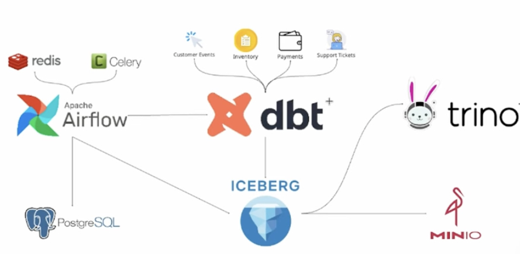

## System Architecture



## Setup Instructions

Step 1: Install postgres & iceberg & trinno with Docker Compose

```bash
docker compose -f compose_iceberg_trino.yml up -d
docker compose -f compose_postgres.yml up -d
```

Step 2: Initialize Astro project and run

```bash
brew install astro
# If you haven't initialized an Astro project yet, run:
# astro dev init
```

Step 3: Install uv

```bash
curl -LsSf https://astral.sh/uv/install.sh | sh
uv sync
```

Step 4: Run Astro project

```bash
astro dev start
```

Step 5: Access Airflow UI

Open your web browser and navigate to http://localhost:8080 to access the Airflow UI.

Step 6: View dbt documentation

```bash
cd dags/dbtproject/ecommerce_dbt

uv run dbt docs generate
# After running the dbt docs generate command in your dbt project, you can serve the documentation locally by running:
dbt docs serve --port 8081
# Then, open your web browser and navigate to http://localhost:8081 to view the dbt documentation.
```
